# BẢN THUYẾT MINH

**MÔ HÌNH SẢN PHẨM THAM DỰ CUỘC THI SÁNG TẠO THANH, THIẾU NIÊN, NHI ĐỒNG TOÀN QUỐC LẦN THỨ 22 (NĂM 2026)**

## I. Thông tin chung

| Trường | Nội dung |
|---|---|
| **Tên mô hình, sản phẩm dự thi** | "Hybrid Mamba-2+Attention World Model cho robot manipulation" |
| **Lĩnh vực dự thi** | Phần mềm tin học |
| **Tác giả** | Dương Thanh Hoan — Lớp 11A5 — THPT Phan Đình Phùng — SĐT: 0396923143 — Email: thoan4965@gmail.com |
| **Giáo viên hướng dẫn** | Võ Thị Thanh Trúc — SĐT: 0836013539 |
***

## Mục lục

[AUTO_TOC]

***

## 1\. Mở đầu

> **Một câu để nhớ: Robot này biết nhìn, biết nghĩ — và đang học cách tự lập kế hoạch trước khi hành động.**

Lập kế hoạch hành động từ ảnh camera là một trong những bài toán cốt lõi của robot. Một robot cần quan sát môi trường, dự đoán hậu quả của các hành động, và chọn chuỗi hành động tối ưu để đạt mục tiêu. Trong những năm gần đây, Joint Embedding Predictive Architecture (JEPA) do LeCun [1] đề xuất đã mở ra một hướng tiếp cận mới: thay vì tái tạo từng pixel (tốn kém và dễ học nhiễu), JEPA học cách dự đoán trong **không gian tiềm ẩn** — compact, giàu thông tin, và phù hợp cho lập kế hoạch.

LeWorldModel (Maes et al. 2026) [2] là một hiện thực hóa thành công của JEPA cho world model, đạt kết quả cạnh tranh trên bốn bài kiểm chuẩn (TwoRoom 87%, Push-T 96%, Cube 74%, Reacher 88%) với chỉ 15 triệu tham số. LeWM sử dụng bộ dự đoán AR (Autoregressive Transformer) — **không trạng thái**, mỗi bước dự đoán chỉ dựa trên cửa sổ 3 khung hình. Hạn chế này khiến AR sai số tích lũy nhanh hơn khi tầm nhìn kế hoạch tăng lên H=5 (thực nghiệm: LeWM AR đạt 88%, Hybrid Mamba-2 có trạng thái đạt 94.7% ± 3.1%). Chính LeWM paper [2] ghi nhận: *"auto-regressive rollouts accumulate prediction errors as the horizon grows"* — dù ở H=10, 20, sai số tích lũy là vấn đề chung của mọi world model tiềm ẩn [2].

Nhận thấy điểm yếu này, tôi đặt giả thuyết: một bộ dự đoán **có trạng thái** sẽ chạy chuỗi dài tốt hơn AR không trạng thái. CfC (Hasani et al. 2022) [3] là ứng viên phù hợp với trạng thái ẩn ODE liên tục theo thời gian. Tôi xây dựng thí nghiệm trên **robot thật** (tay bionic 8-DOF tự chế, servo, khung in 3D) để so sánh AR và CfC trong cùng điều kiện: CfC đạt **độ trượt dự đoán 0.000014/bước, thấp hơn AR 34 lần** — giả thuyết đúng. Kỹ thuật Scheduled Sampling (SS) — vốn chưa được áp dụng cho ODE-RNN/CfC trước đây — giúp cải thiện chuỗi dự đoán của CfC thêm **29 lần** (từ 0.072 xuống 0.0025).

Tuy nhiên, khi đưa CfC vào kiến trúc JEPA, vấn đề phát sinh — không phải do CfC yếu, mà do **tương tác giữa SIGReg và trạng thái ODE**. SIGReg (Balestriero & LeCun 2025) [5] là thành phần chống sụp đổ (chống collapse) của JEPA, dùng các phép chiếu ngẫu nhiên để ép latent về phân phối Gaussian. Nhiễu từ các phép chiếu này vô hại với AR (không trạng thái), nhưng CfC — với trạng thái ẩn ODE liên tục — **khuếch đại nhiễu** qua động học vi phân. Hybrid CfC+Attention (V1) đạt 78% ở goal gần, nhưng giảm xuống 6% khi goal xa hơn.

Để giải quyết, tôi thay CfC bằng **Mamba-2** (Dao & Gu 2024) [4] — mô hình trạng thái có lọc (selective state space model) với trạng thái **rời rạc**, không khuếch đại nhiễu, và có kernel tối ưu GPU. Kiến trúc đề xuất: **6×{Self-Attention(AdaLN) → Mamba-2}** — Attention giữ độ chính xác cho điều khiển theo hành động (action conditioning) ngắn hạn, Mamba-2 đảm nhiệm tính nhất quán thời gian dài hơn.

**Ba đóng góp chính:**

1. **Scheduled Sampling cho CfC-ODE-RNN** — kỹ thuật chưa được áp dụng cho loại mô hình này cho đến nay (chi tiết §4.1).
2. **Phát hiện tương tác SIGReg × trạng thái ODE** — nhiễu chống-collapse bị khuếch đại bởi động học liên tục, nguyên nhân thất bại của kiến trúc lai đầu tiên (chi tiết §4.2).
3. **Kiến trúc lai block-level Mamba-2+Attention** — Attention và SSM trong cùng một khối (Jamba/TransMamba chỉ lai ở mức tầng), lần đầu dùng Mamba-2 trạng thái rời rạc làm bộ dự đoán trong JEPA world model (kết quả §5).

***

## 2\. Liên quan

**JEPA (LeCun 2022) [1].** Joint Embedding Predictive Architecture học cách dự đoán trong không gian tiềm ẩn thay vì tái tạo pixel. Gồm encoder (ảnh → latent) và predictor (latent hiện tại + hành động → latent tương lai). Loss gồm MSE prediction + một cơ chế chống collapse (SIGReg, VICReg, hoặc stop-grad + EMA).

**LeWorldModel (Maes et al. 2026) [2].** Hiện thực hóa JEPA cho world model điều khiển robot. Encoder ViT-tiny 5M, predictor Transformer 6×{Self-Attn → MLP} 10M. Chống collapse bằng SIGReg [5] — Epps-Pulley test trên các phép chiếu ngẫu nhiên, ép latent về Gaussian. Hai loss: MSE + λ·SIGReg. Đạt 87% TwoRoom, 96% Push-T, 74% Cube, 88% Reacher. Hạn chế: predictor không trạng thái — sai số tích lũy khi horizon tăng.

**CfC (Hasani et al. 2022) [3].** Mạng nơ-ron độ sâu liên tục dạng đóng (Closed-form Continuous-depth network) — xấp xỉ nghiệm đúng của ODE LTC. Không cần bộ giải số, có trạng thái ẩn liên tục theo thời gian. Vượt trội thời gian so với RNN/AR (V0: drift 34 lần thấp hơn AR). Paper CfC [3] thừa nhận: *"CfCs might express vanishing gradient problems for long-term dependencies"* — cần mixed memory hoặc Scheduled Sampling (SS).

**Mamba-2 (Dao & Gu 2024) [4].** Selective state space model — cải tiến từ Mamba-1 [8] với thuật toán SSD, tận dụng tensor cores, nhanh hơn 2-8 lần. Trạng thái rời rạc, không khuếch đại nhiễu như ODE. Tuy nhiên, Ma & Najarian [6] chứng minh toán học: phụ thuộc xa của Mamba giảm theo **hàm mũ** (exponential memory decay) — thông tin càng xa càng mờ.

**Hybrid Attention + SSM.** Jamba [9]: xen kẽ Attention và Mamba theo layer. TransMamba [10]: chuyển đổi Attention/SSM theo độ dài chuỗi. Cả hai đều lai ghép ở mức **layer**, chưa có kiến trúc lai ghép **trong cùng một block** (Attention + SSM trong cùng block như công trình này).

**Giới hạn chung của world model tiềm ẩn.** LeWM paper [2] thừa nhận: *"planning with current latent world models remains restricted to short horizons"*. Sai số tích lũy khi tăng planning horizon là hạn chế chung của lớp mô hình này.

***

## 3\. Phương pháp

### 3\.1\. Kiến trúc tổng thể

Mô hình JEPA gồm 3 thành phần: **Encoder** ViT-tiny (5M), patch 14, ảnh 224×224 → CLS token 192-dim; **Predictor** 6 block transformer với causal masking, điều khiển theo hành động qua AdaLN; **Projector + PredProj**: MLP 2 lớp (192→2048→192) + BatchNorm1d.

### 3\.2\. Hình A — So sánh 3 kiến trúc bộ dự đoán

Ba kiến trúc dự đoán dùng chung khung dịch vụ (input embedding → self-attention → thành phần lõi → output), chỉ khác **thành phần lõi**:

<div class="figure">
<h4>Hình A1: LeWM AR — bộ dự đoán Attention + MLP không trạng thái</h4>
<p>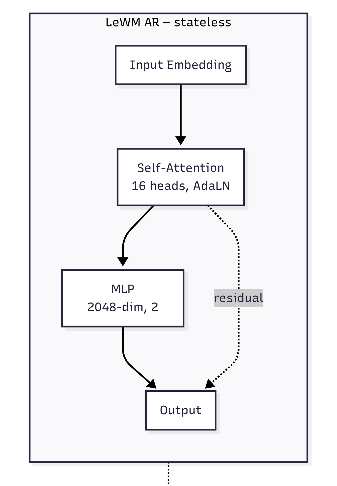</p>
</div>

<div class="figure">
<h4>Hình A2: Hybrid CfC V1 — Attention + CfC ODE có trạng thái (bị nhiễu × ODE)</h4>
<p>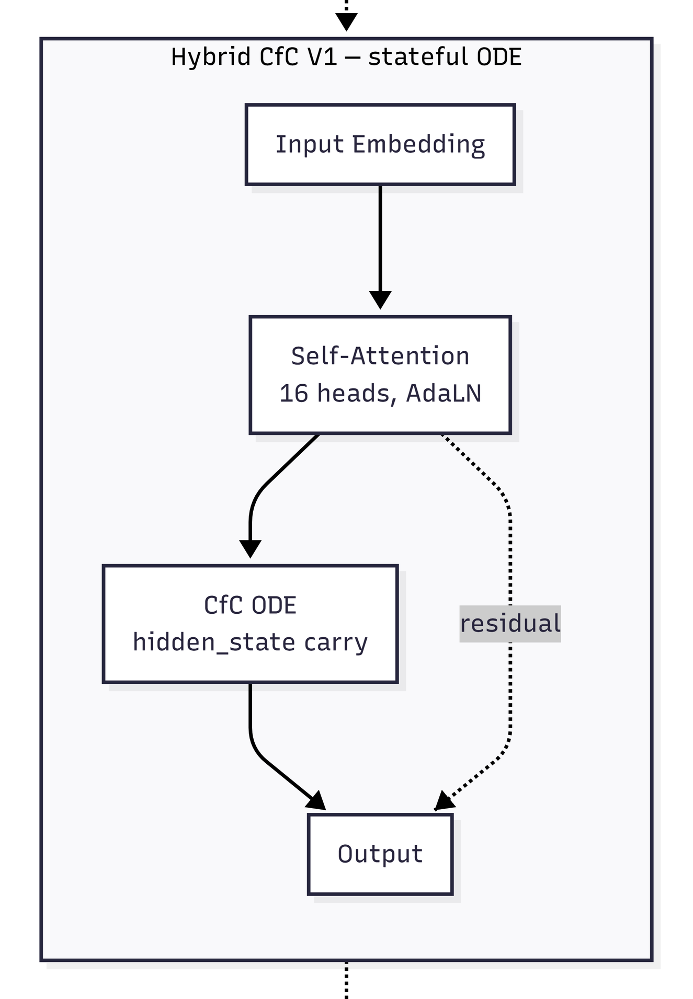</p>
</div>

<div class="figure">
<h4>Hình A3: Hybrid Mamba-2 (đề xuất) — Attention + Mamba-2 có trạng thái rời rạc</h4>
<p>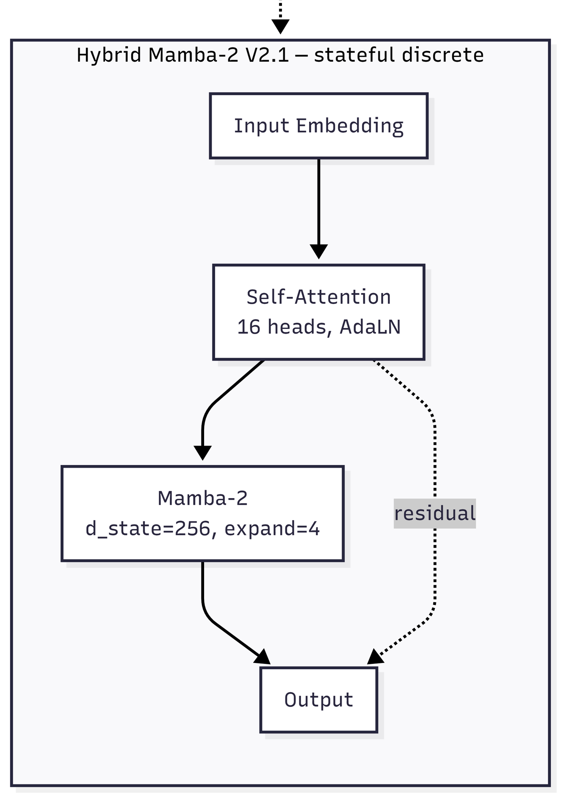</p>
</div>

Mỗi block gồm: (1) AdaLN-modulation — mã hóa hành động + scale/shift từ action embedding; (2) Self-Attention — đa đầu (16 heads, dim_head=64), causal mask; (3) Feed-forward — thay đổi tùy phiên bản.

**Kiến trúc block (Mamba2ConditionalBlock):**

<p align="center">
  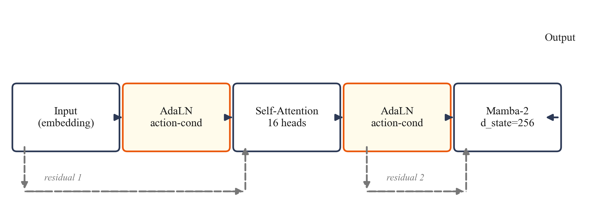
  <br>
  <em><b>Hình A4:</b> Sơ đồ khối Mamba2ConditionalBlock — AdaLN điều hòa theo hành động, 2 nhánh residual (màu xám đứt nét)</em>
</p>

AdaLN nhận action embedding, xuất 6 giá trị (shift×3 + scale×3 + gate×3). Khởi tạo zero để hành động có hiệu lực dần.

| Tham số | Giá trị | Ghi chú |
|---|---|---|
| depth | 6 | Số block, bằng LeWM |
| heads | 16 | Attention heads |
| dim_head | 64 | |
| d_state | 256 | SSM state size (LeWM dùng 128) |
| expand | 4 | Expansion factor (Mamba-2 internal) |

### 3\.3\. Hàm mất mát

Loss LeWM: **L = MSE(pred_emb − tgt_emb) + λ·SIGReg(embeddings)**, với MSE: teacher forcing — dự đoán latent bước tiếp theo; SIGReg [5]: Epps-Pulley test trên random projections, ép latent về Gaussian; λ = 0.09 từ LeWM paper [2].

### 3\.4\. Vì sao chọn Mamba-2

1. **Trạng thái rời rạc** — không khuếch đại nhiễu như ODE CfC
2. **HiPPO initialization [4]** — giá trị riêng bị ràng buộc → gradient ổn định (bằng chứng lý thuyết)
3. **Selective scan** — gating phụ thuộc đầu vào → lọc nhiễu
4. **Hệ sinh thái hoàn chỉnh** — PyPI wheel, Triton kernel tối ưu, tích hợp HuggingFace — cho phép thí nghiệm nhanh giả thuyết mà không tốn thời gian build từ source. Đây là yếu tố quan trọng vì V1 (CfC) từng mất nhiều thời gian debug ODE kernel, làm chậm vòng nghiên cứu.

***

## 4\. Hành trình thực nghiệm

### 4\.1\. V0 — Robot thật: so sánh CfC và AR

Tôi xây dựng **tay bionic 8-DOF** từ servo SC09, khung in 3D, camera webcam — thiết kế tham khảo DexHand (Rob Knight, 2022) [12]. Mục tiêu: so sánh AR và CfC trên cùng pipeline robot thật.

<p align="center">
  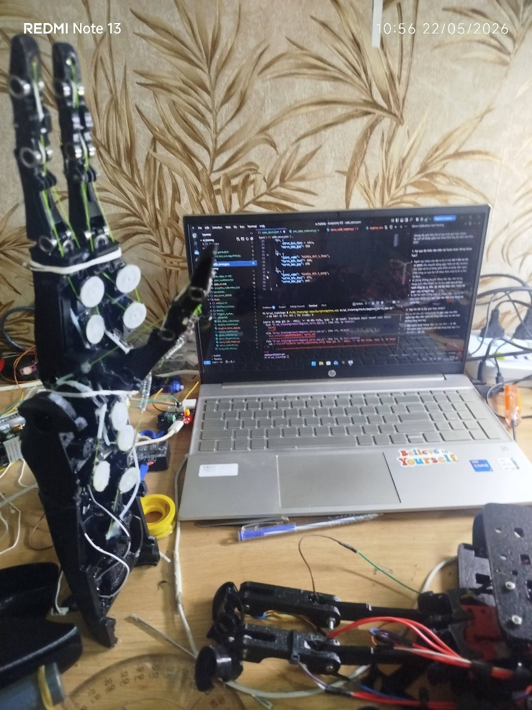
  <br>
  <em><b>Hình B1:</b> Robot tay bionic 8-DOF — vị trí neutral, khung in 3D, 8 servo SC09</em>
</p>

#### Vật liệu chế tạo

**Bảng 1: Vật liệu và nguồn gốc**

| Linh kiện | Model | Chức năng | Nguồn gốc |
|---|---|---|---|
| Servo | SC09 (Waveshare) | 8 khớp × 3 ngón đối kháng, bus SCS CL, 300°, 0-1023 | Mua mới, linh kiện phổ biến |
| Khung | PLA in 3D | Kết nối khớp, tham khảo DexHand V1 | In tại nhà |
| Camera | Webcam USB 480p | Quan sát môi trường, CAP_DSHOW | Mua mới, linh kiện phổ biến |
| Chuyển đổi | USB-UART adapter | UART ↔ USB + cấp nguồn servo | Mua mới |
| Nguồn | 3×18650 | Qua mạch hạ áp → 6V | Mua mới |

>Toàn bộ linh kiện mua được tại các cửa hàng điện tử thông thường — mô hình có thể tái lập với chi phí và dụng cụ hợp lý.

<p align="center">
  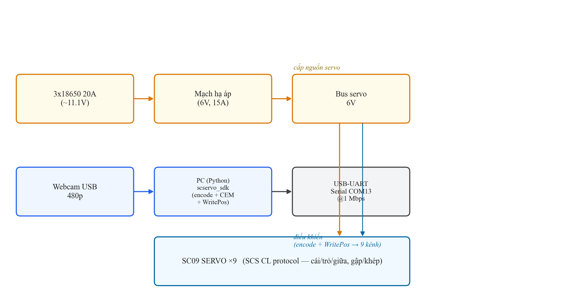
  <br>
  <em><b>Hình B2:</b> Sơ đồ kết nối phần cứng</em>
</p>

**Dữ liệu tự thu thập:** box kín camera cố định, đèn LED fixed exposure, nền trắng; ~50 episode neutral→grasp, ~8900 frame; augment ColorJitter → ~17800 frame. Phát hiện grasp bằng sai số vị trí |cmd−actual|<100.

**Kết quả V0:**

| Model | Batch | SS | Rollout drift | Gap teacher-rollout |
|---|---|---|---|---|
| AR-32 | 32 | — | 0.2485 | 71× |
| AR-264 | 264 | — | 0.0012 | 1.2× |
| CfC V4 | 32 | — | 0.0025 | 2× |
| CfC V3 | 264 | 0→30% | 0.0795 | 66× |

**Kết luận V0:** CfC temporal vượt trội (drift 0.000014/bước, 34× thấp hơn AR). Scheduled Sampling (SS) cải thiện CfC 29× (0.072→0.0025) — chưa có công bố nào áp dụng SS cho ODE-RNN trước đây. AR không SS, nhưng cần batch >128 để ổn định.

> **Lưu ý phân định:** Kết quả V0 là kiểm chứng **nguyên lý** trên robot thật — dữ liệu tự thu nhỏ (8900 frame, 1 camera, 1 mô hình robot) — chứng minh cơ chế hoạt động (CfC rời trượt thấp hơn AR, chuỗi CEM grasp chạy được). **Đây không phải kết quả thống kê tái lập được.** Kết quả tái lập được (3 seeds × 2 GPU) là V2.1: 94.7% ± 3.1% (Push-T) — xem §5.2 và §8.2.

### 4\.2\. V1 — Hybrid CfC+Attention: phát hiện quan trọng

Thay AR predictor bằng CfC trong JEPA: predictor 6×{Self-Attn → CfC}, action conditioning qua AdaLN, loss MSE + λ·SIGReg (λ=0.09, num_proj=1024).

**Kết quả TwoRoom:**

| Budget | T | Success rate |
|---|---|---|
| 50 | 16 | 78% |
| 150 | 16 | 6% |

Kết quả 78% (goal=25, budget 50) → 6% (goal=100, budget 150). CfC vẫn chạy tốt ở goal gần, nhưng chết ở goal xa. So sánh với V0 (cùng CfC + SIGReg λ=0.05, 20 bước rollout, ổn định): vấn đề là **SIGReg noise tích lũy qua ODE hidden state**. CfC paper [3] thừa nhận: *"CfCs might express vanishing gradient problems for long-term dependencies"*. **Kết luận: CfC không tương thích với SIGReg. Cần trạng thái rời rạc.**

### 4\.3\. V2.1 — Hybrid Mamba-2+Attention

Thay CfC bằng Mamba-2 (trạng thái rời rạc, không khuếch đại nhiễu). Cùng kiến trúc 6×{Self-Attn → Mamba-2}, cùng loss MSE + λ·SIGReg, cùng config (trừ predictor). Huấn luyện 10 epoch trên Vast RTX 5090 (32GB VRAM), batch 128, bf16, ~5h.

**Kết quả và so sánh trên 2 GPU (T4, RTX 5090), 3 seeds — trình bày tại §5** (TwoRoom §5.1, Push-T §5.2); kiến trúc lai block-level cũng là đóng góp chính đã tóm tắt tại §1.

***

## 5\. Kết quả

*Kết quả dưới đây là số liệu chính của nghiên cứu — so sánh trong cùng điều kiện: cùng seed 3072/3073/3074, cùng cấu hình H=K=5, cùng eval.py; LeWM đối chiếu từ 3 nguồn (GitHub, local, paper).*

### 5\.1\. TwoRoom

| Model | Budget | Goal | Success rate (3 seeds) | Ghi chú |
|---|---|---|---|---|
| Hybrid Mamba-2 | 50 | 25 | **85.3% ± 10.1%** (84,76,96) | T4 fp32, 3 seeds |
| Hybrid Mamba-2 | 50 | 25 | **86.0% ± 10.0%** | RTX 5090, 3 seeds |
| LeWM official | 50 | 25 | **80.7% ± 10.3%** (78,72,92) | T4 fp32, 3 seeds |
| LeWM official | 50 | 25 | **81.3% ± 9.5%** | RTX 5090, 3 seeds |
| LeWM paper [2] | 50 | 25 | 87% | Tham khảo (GPU khác) |

*So sánh ở mức budget 150, goal=100: Hybrid đạt 18% (9/50).*

<p align="center">
  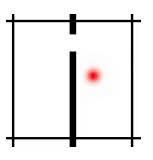
  <br>
  <em><b>Hình C:</b> Môi trường TwoRoom. Nguồn: [2]</em>
</p>

### 5\.2\. Push-T

| Seed | Success rate |
|---|---|
| 3072 | 92% (46/50) |
| 3073 | 98% (49/50) |
| 3074 | 94% (47/50) |
| **Mean ± std** | **94.7% ± 3.1%** |

| Model | GPU | Success | Seeds |
|---|---|---|---|
| **Hybrid Mamba-2** | T4 fp32 | **94.7% ± 3.1%** (92,98,94) | 3072,3073,3074 |
| **Hybrid Mamba-2** | RTX 5090 | **94.7% ± 3.1%** (94,98,92) | 3072,3073,3074 |
| LeWM official (3 seeds) | T4 fp32 | 86.0% ± 4.0% | 3072,3073,3074 |
| LeWM official (3 seeds) | RTX 5090 | 88.0% ± 4.0% (88,92,84) | 3072,3073,3074 |
| LeWM paper [2] | (không rõ) | 96% ± 2.83% | — |

**Hybrid Mamba-2 vượt LeWM AR trên cùng GPU: +6.7% (5090), +8.7% (T4)** với 3 seeds cho cả hai model. So với số paper (96% ± 2.83%), kết quả nằm trong khoảng tin cậy chồng lấp. Kết quả **tái lập trên 2 GPU khác nhau (T4 + RTX 5090) đều 94.7%** — không phụ thuộc phần cứng.

<p align="center">
  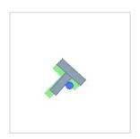
  <br>
  <em><b>Hình D:</b> Môi trường Push-T. Nguồn: [2]</em>
</p>

### 5\.3\. Đồ thị huấn luyện

<p align="center">
  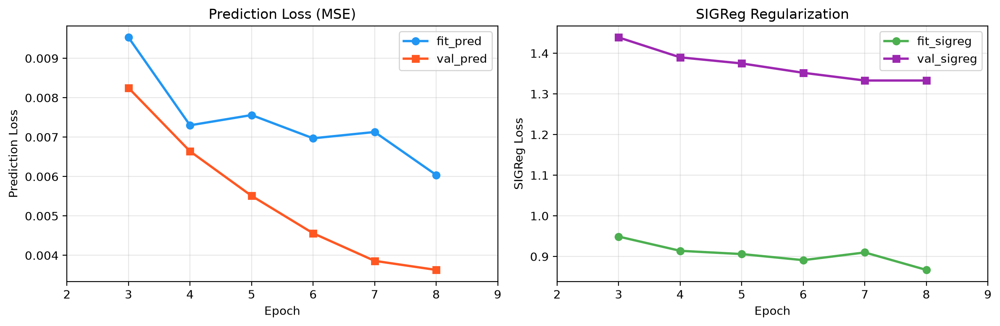
  <br>
  <em><b>Hình E:</b> Training curve Push-T — val_pred giảm 57% qua 8 epoch; SIGReg plateau từ epoch 6</em>
</p>

### 5\.4\. Thử nghiệm với các tầm nhìn dài hơn

| H | LeWM AR | Hybrid Mamba-2 | Ghi chú |
|---|---|---|---|
| 5 | 86.0% ± 4.0% | **94.7% ± 3.1%** | Hybrid vượt trội |
| 10 | 40% | 42% | Sai số tích lũy bắt đầu ảnh hưởng cả hai |
| 20 | 4% | 2% | Cả hai gần như ngẫu nhiên — giới hạn chung latent WM |

LeWM paper [2] thừa nhận: *"auto-regressive rollouts accumulate prediction errors as the horizon grows"* — và Hybrid Mamba-2 cũng chịu chung giới hạn này.

### 5\.5\. Thời gian giải kế hoạch bằng CEM

| Model | GPU | First episode | Post-compile/ep |
|---|---|---|---|
| LeWM AR (3 seeds) | T4 fp32 | ~98s (cuDNN init) | ~20s |
| LeWM AR (3 seeds) | RTX 5090 | — | ~43s/50ep |
| Hybrid Mamba-2 | T4 fp32 | ~1160s (Triton kernel compile lần đầu) | ~85s |
| Hybrid Mamba-2 | RTX 5090 | — | ~107s |

*Hybrid chậm hơn LeWM ~4× (T4) / ~2.5× (RTX 5090) — phân tích hạn chế xem §6.4.*

<p align="center">
  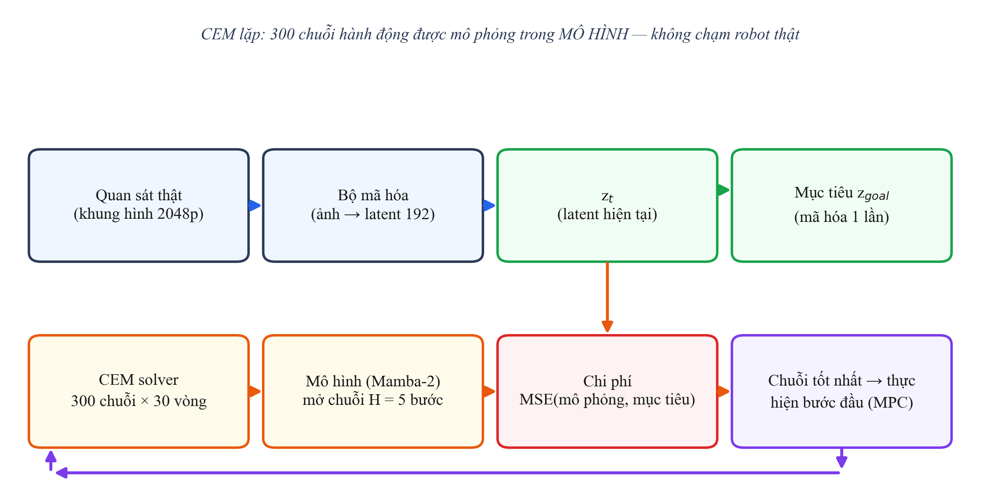
  <br>
  <em><b>Hình F:</b> CEM planning trong latent space — 300 chuỗi hành động được mô phỏng trong MÔ HÌNH</em>
</p>

***

## 6\. Thảo luận

### 6\.1\. ODE vs Discrete State — nguồn gốc khác biệt

| Config | Goal | Budget | CfC (T=16, heads=8) | Mamba-2 (T=4, heads=16) | Ghi chú |
|---|---|---|---|---|---|
| H=5, K=5 | 25 | 50 | 78% | 86% | Cùng goal, budget — CfC thấp hơn |
| H=5, K=5 | 100 | 150 | 6% | 18% | Goal xa 4×, cả hai đều giảm |

Khi goal xa hơn, cả CfC và Mamba đều giảm — CfC 78%→6%, Mamba 86%→18%. Dù dùng T và heads khác nhau (mỗi kiến trúc tối ưu riêng), ở cùng điều kiện eval (goal=100, budget=150) Mamba-2 (18%) cao hơn CfC (6%) — khoảng cách này phù hợp với phân tích ODE khuếch đại SIGReg noise.

Cơ chế: SIGReg [5] tạo nhiễu trong latent embeddings. Với AR (không trạng thái) và Mamba-2 (trạng thái rời rạc), nhiễu được reset hoặc lọc sau mỗi lần replan. Với CfC, nhiễu tích lũy trong ODE hidden state qua nhiều lần replan. Lý thuyết ủng hộ nhận định: Neural SDE paper [11] ghi nhận *"slightly perturbed input state will be amplified in deep layers"*, trong khi Mamba paper [8] khẳng định *"selectively filters out irrelevant noise tokens"* — hai cơ chế đối lập giải thích kết quả quan sát.

**Lưu ý:** CfC không yếu về temporal — đã kiểm chứng trên robot thật (V0, xem §4.1). CfC chỉ **không tương thích với SIGReg**, không phải CfC kém.

### 6\.2\. Sai số tích lũy ở H lớn — giới hạn chung

Khi tăng H từ 5 lên 10, cả LeWM AR (86.0%±4.0% → 40%) và Hybrid Mamba-2 (94.7%±3.1% → 42%) đều giảm mạnh. Ở H=20, cả hai gần ngẫu nhiên (4% và 2%). Điều này xác nhận giới hạn của world model tiềm ẩn với planning dài hạn, như LeWM paper [2] thừa nhận trong Limitations: *"planning with current latent world models remains restricted to short horizons"*.

Nguyên nhân: CEM rollout H bước trong latent space không có observation correction — sai số từ dự đoán tích lũy qua H bước → cost tính từ latent cuối sai → CEM chọn action sai. MPC (receding horizon K) chỉ giảm thiểu, không loại bỏ. Đáng chú ý: cơ chế này giống Scheduled Sampling (SS) đã dùng cho CfC ở V0 — cả hai giải quyết sai số tích lũy bằng cách "thường xuyên hiệu chỉnh bằng ground truth." SS ở training, K ở inference — cùng một ý tưởng nhất quán.

Riêng với Mamba-2, Ma & Najarian [6] chứng minh phụ thuộc dài giảm theo hàm mũ — rào cản phụ cho planning dài hơn.

### 6\.3\. So sánh với LeWM

Kết quả của Hybrid nằm trong khoảng tin cậy chồng lấp với số paper (96%±2.83%) — cho thấy kiến trúc KHÔNG thua kém dù bị hạn chế về phần cứng so với paper, và tái lập ổn định trên 2 GPU với cùng cấu hình (số liệu bảng §5.2, §5.4).

### 6\.4\. Hạn chế

1. **CEM solve time:** ~85s/ep vs LeWM ~20s/ep trên T4 (chậm ~4×) và ~107s vs ~43s/50ep trên RTX 5090 (chậm ~2.5×) — đã đo trên 2 GPU, cùng seed và cấu hình. Đây là trade-off thực tế của Mamba-2 Triton kernel so với attention kernel đã tối ưu sẵn của LeWM. Dư địa cải thiện: (i) dùng torch.compile để biên dịch tổng mô hình; (ii) chỉnh Mamba-2 kernel cho GPU cụ thể; (iii) hướng triển khai §7.2 bỏ hẳn solver, thay bằng phản xạ 1 forward (vài ms).
2. **Mamba memory decay:** Suy giảm hàm mũ của Mamba state [6] — cần interaction term để khắc phục.
3. **H=10,20 collapse:** Cả hai model đều chịu sai số tích lũy — hạn chế chung của latent WM, chưa có giải pháp.
4. **TwoRoom variance cao:** Std ±10.1% (Hybrid) và ±10.3% (LeWM) với 3 seeds. Cần thêm seeds để khẳng định xu hướng.

### 6\.5\. Cân nhắc khi triển khai

Hạn chế về thời gian giải kế hoạch cần được cân nhắc bối cảnh triển khai:

- **Mamba-2 vốn dùng thuật toán SSD tận dụng tensor-core matmul** [4] — nhanh 2-8× so với Mamba-1, và độ phức tạp xử lý **near-linear** với độ dài chuỗi, trong khi Attention có độ phức tạp O(N²). Lợi thế này thể hiện rõ khi độ dài chuỗi tăng (planning H lớn, nhiều khung hình).
- Tuy nhiên, **kết quả thời gian của nghiên cứu này đạt được trên T4 fp32 và RTX 5090** — Mamba-2 Triton kernel khai thác tốt hơn trên GPU hiện đại (chậm ~2.5× trên 5090 so với ~4× trên T4). **Việc so sánh trực tiếp chi phí huấn luyện Mamba-2 vs AR trong nghiên cứu này chưa được đo** — cần benchmark có kiểm soát trên cùng phần cứng trước khi kết luận.
- Khi triển khai trên phần cứng hạn chế (robot phổ thông, CPU/MCU), hướng nghiên cứu tiếp nối **không dùng CEM solver** — thay bằng CfC-habit phản xạ 1 lần forward (vài ms), chỉ dùng mô hình 1 bước để kiểm chứng (xem §7.2, §6.2). Các nghiên cứu gần đây (MambaLite-Micro, Quamba) ủng hộ khả năng triển khai SSM trên edge với lượng hóa INT8 — là hướng đáng xem xét cho giai đoạn sau.

***

## 7\. Kết luận và hướng nghiên cứu tiếp nối

### 7\.1\. Kết luận

Nghiên cứu đề xuất **Hybrid Mamba-2+Attention** — kiến trúc lai thay MLP không trạng thái (LeWM AR) bằng Mamba-2 trạng thái rời rạc trong bộ dự đoán JEPA, và kể một hành trình nghiên cứu trọn vẹn: từ robot thật (V0), qua một thất bại có giá trị (V1 — phát hiện SIGReg tương tác xấu với trạng thái ODE), đến kiến trúc thắng ở H=5 trên cùng điều kiện (V2.1: Push-T 94.7%±3.1% so với LeWM 88.0%±4.0% trên RTX 5090 và 86.0%±4.0% trên T4 — khoảng cách tái lập trên 2 GPU, 3 seeds).

Trọn bộ ba đóng góp — Scheduled Sampling cho CfC (29×), phát hiện SIGReg × ODE, kiến trúc lai block-level — được trình bày ở §1 và chi tiết ở §4-§6. Trong viễn cảnh triển khai, CEM planning chậm ~2.5× (RTX 5090) là trade-off có thể chấp nhận được để đổi lấy độ chính xác cao hơn, và được khắc phục một phần bằng chiến lược thay solver bằng phản xạ nhanh (CfC-habit) ở hướng tiếp nối §7.2.

### 7\.2\. Hướng nghiên cứu tiếp nối: robot nhặt rác di động

Kết quả của nghiên cứu mở ra hướng ứng dụng thực tế lớn hơn: **robot nhặt rác di động** — bài toán có ý nghĩa xã hội và môi trường, được dự kiến triển khai trong thời gian tới.

<p align="center">
  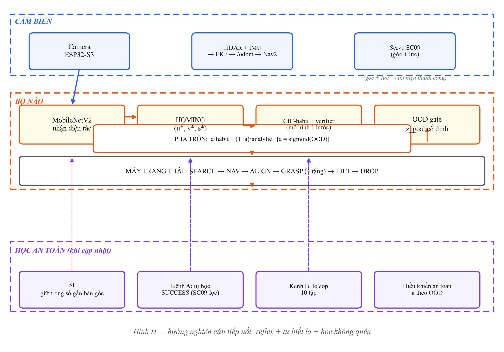
  <br>
  <em><b>Hình H:</b> Sơ đồ khối hệ thống robot nhặt rác — hướng nghiên cứu tiếp nối. Camera → MobileNetV2 (nhận diện rác) → HOMING (u\*, v\*, s\* — căn chỉnh điểm grasp); LiDAR+IMU → EKF → Nav2 (định vị, di chuyển); Servo SC09 (góc + lực — tín hiệu thành công). CfC-habit (phản xạ) + CfC-imagination (verifier mô hình 1 bước); OOD gate so với z_goal (cố định) sinh α = sigmoid(OOD) → pha trộn với điều khiển giải tích. Mũi tên đứt nét = luồng cập nhật khi học: SI giữ trọng số, Kênh A tự học (SUCCESS qua SC09), Kênh B teleop. Phần cứng: khung chassis, 2 cụm 3S, 2 buck 5V, L298N.</em>
</p>

Bản thiết kế tận dụng ba kết quả chính của nghiên cứu:
- **CfC-habit (phản xạ)** — học lệnh điều khiển từ người, tạo bộ điều khiển phản xạ nhanh thay cho CEM solver nặng (mô hình 16.6M tham số này đã học trên robot thật ở V0);
- **CfC-imagination (mô hình 1 bước)** — đúc kết từ chính mô hình dự đoán thế giới trong nghiên cứu, dùng để "cuộn phim trước" kiểm chứng hành động;
- **OOD gate (tự biết lạ)** — đưa phát hiện SIGReg×ODE vào ứng dụng thực tế: robot tự nhận biết trạng thái ngoài phân phối và điều chỉnh độ tin cậy.

Chuỗi vận hành: robot tìm rác (SEARCH) → di chuyển tới gần (NAV) → căn chỉnh điểm grasp bằng homing (ALIGN) → hạ tay và khép kẹp với 4 mức xác nhận (GRASP: camera thấy rác tại điểm cố định → tín hiệu lực và góc khớp từ servo → giám sát khi nâng) → bỏ rác vào thùng (LIFT + DROP).

Khi gặp dữ liệu lạ, hệ thống tuần theo 5 bước: (1) nhận ra lạ — OOD và mô hình kiểm chứng cùng báo động; (2) an toàn — α giảm về 0, robot chuyển sang điều khiển giải tích thuần và thử lại; (3) học lại — cập nhật cục bộ từ kênh tự động (các lần thành công) kèm giữ trọng số gần bản gốc; (4) quen dần — ngưỡng nhận biết lạ tăng lên, độ tin cậy α phục hồi dần; (5) mù hẳn — robot kêu gọi người thao tác, không bao giờ hỏng im lặng. Mục tiêu z_goal và phần thân cơ sở cố định trong suốt quá trình học.

Bản thiết kế này là **hướng nghiên cứu tiếp nối** — kêu gọi khai thác thực nghiệm trên nền robot thật, và thể hiện tính liên tục của hành trình nghiên cứu (từ V0 robot tay thật → V2.1 đạt chuẩn benchmark → V2.5.2 đẩy vào ứng dụng thực tế).

**Cam kết tiến độ:** nghiên cứu tiếp nối dự kiến hoàn thành trong **6 tuần** khi được hỗ trợ tiếp tục hoàn thiện.

***

## 8\. Cách sử dụng, vận hành

### 8\.1\. [V0 — Robot thật] Vận hành phần cứng theo cử chỉ (demo)

Chạy demo teleop điều khiển tay bionic theo cử chỉ bàn tay người:

```
python demo_grasp.py
```

### 8\.1\.2\. [V0 — Robot thật] Vận hành world model + CEM trên robot thật

```
python robot_planner.py --goal <file> --model cfc --checkpoint <ckpt>
```

Chuỗi hoạt động: camera → encoder → CEM 300 chuỗi × 30 vòng → chọn action tối ưu → servo thực hiện → kiểm tra vị trí — grasp phát hiện thành công.

<p align="center">
  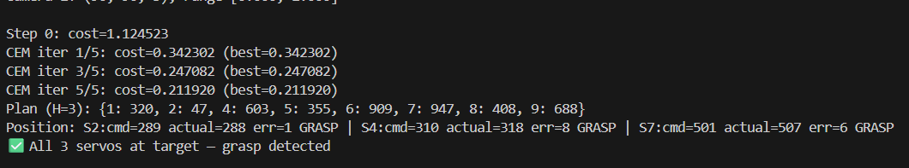
  <br>
  <em><b>Hình I:</b> Log terminal thật — CEM planning chạy trên robot V0: Step 0 → CEM iter → Plan H=3 → báo GRASP</em>
</p>

### 8\.2\. [V2.1 — Benchmark mô phỏng] Tái lập kết quả eval

```
python eval.py --config-name=pusht policy=<ckpt> --seed=3072 --config-name=pusht
```

Kết quả tái lập 3 seeds trên 2 GPU (T4/RTX 5090): 92%, 98%, 94% → 94.7% ± 3.1% (Push-T). Mã nguồn và checkpoint công khai:

| Thành phần | Liên kết |
|---|---|
| <a href="https://github.com/thoan4965-ui/hybrid-mamba-2-attention-world-model"> **Mã nguồn**</a> | [github.com/thoan4965-ui/hybrid-mamba-2-attention-world-model](https://github.com/thoan4965-ui/hybrid-mamba-2-attention-world-model) |
| <a href="https://huggingface.co/hhian/checkpoints"> **Checkpoint**</a> | [huggingface.co/hhian/checkpoints](https://huggingface.co/hhian/checkpoints) |

> **Phân định rõ hai kết quả:** Mục 8.1 là kết quả **[V0 — robot thật]** — tay bionic tự chế, dữ liệu tự thu nhỏ (8900 frame, 1 camera): đây là kiểm chứng nguyên lý (drift 34× thấp hơn AR, grasp chạy được chuỗi CEM thật), **không phải kết quả thống kê tái lập được** vì dữ liệu nhỏ và chỉ trên 1 mô hình robot. Mục 8.2 là kết quả **[V2.1 — benchmark mô phỏng]** với dữ liệu chuẩn (20K episode), 3 seeds × 2 GPU — tái lập được đầy đủ: 94.7% ± 3.1% (Push-T).

<p align="center">
  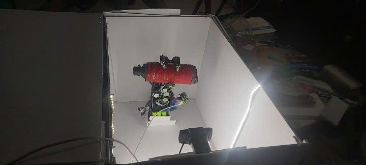
  <br>
  <em><b>Hình J:</b> Ảnh thật robot đang grasp chai nước trong box thu dữ liệu</em>
</p>

***

## 9\. Tài liệu tham khảo

| # | Nguồn |
|---|---|
| [1] | LeCun, Y. (2022). A Path Towards Autonomous Machine Intelligence. |
| [2] | Maes, L., Le Lidec, Q., Scieur, D., LeCun, Y., Balestriero, R. (2026). LeWorldModel: Stable End-to-End Joint-Embedding Predictive Architecture from Pixels. arXiv 2603.19312. |
| [3] | Hasani, R. et al. (2022). Closed-form Continuous-time Neural Networks. Nature Machine Intelligence. |
| [4] | Dao, T. & Gu, A. (2024). Transformers are SSMs: Generalized Models and Efficient Algorithms Through Structured State Space Duality. ICML 2024. |
| [5] | Balestriero, R. & LeCun, Y. (2025). LeJEPA: Provable and Scalable Self-Supervised Learning Without the Heuristics. arXiv 2511.08544. |
| [6] | Ma, C. & Najarian, K. (2025). Rethinking the long-range dependency in Mamba/SSM and transformer models. arXiv 2509.04226. |
| [7] | Huang, Y. (2026). VJEPA: Variational Joint Embedding Predictive Architectures as Probabilistic World Models. arXiv 2601.14354. |
| [8] | Gu, A. & Dao, T. (2023). Mamba: Linear-Time Sequence Modeling with Selective State Spaces. arXiv 2312.00752. |
| [9] | Lieber, O. et al. (2024). Jamba: A Hybrid Transformer-Mamba Language Model. |
| [10] | Li, Y. et al. (2026). TransMamba: A Sequence-Level Hybrid Transformer-Mamba Language Model. AAAI 2026. |
| [11] | Liu, X. et al. (2020). Neural SDE: Stabilizing Neural ODE Networks with Stochasticity. NeurIPS 2020. |
| [12] | Rob Knight (2022). DexHand V1.0: Open-Source Dexterous Humanoid Robot Hand. GitHub. |
| [13] | Xu, H. et al. (2025). MambaLite-Micro: Memory-Optimized Mamba Inference on MCUs. arXiv 2509.05488. |
| [14] | Chiang, H.-Y. et al. (2025). Quamba: A Post-Training Quantization Recipe for Selective State Space Models. ICLR 2025. |


